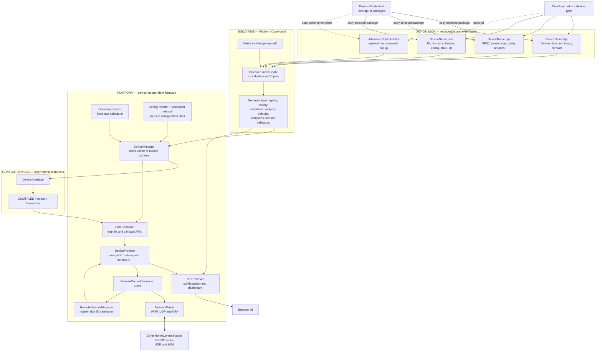
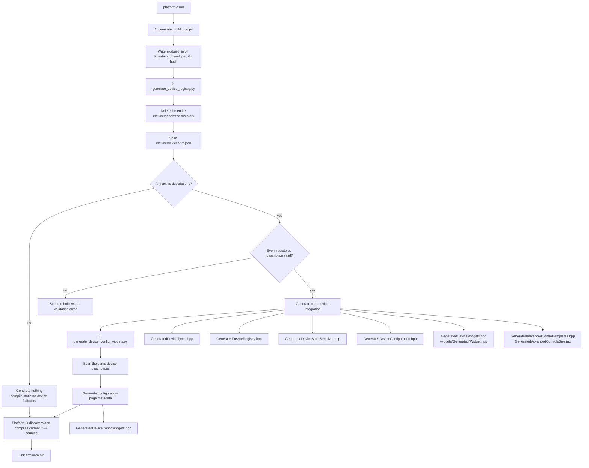
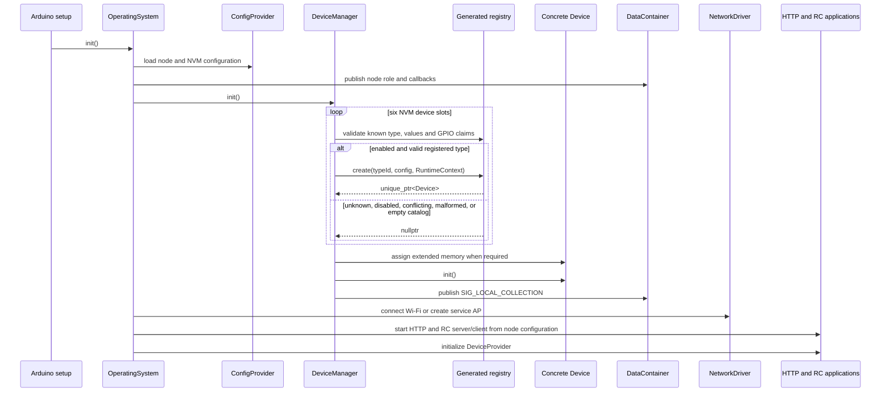
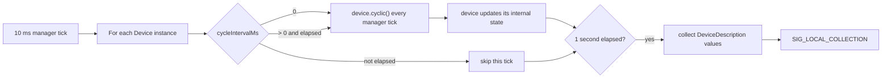
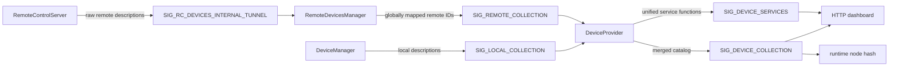
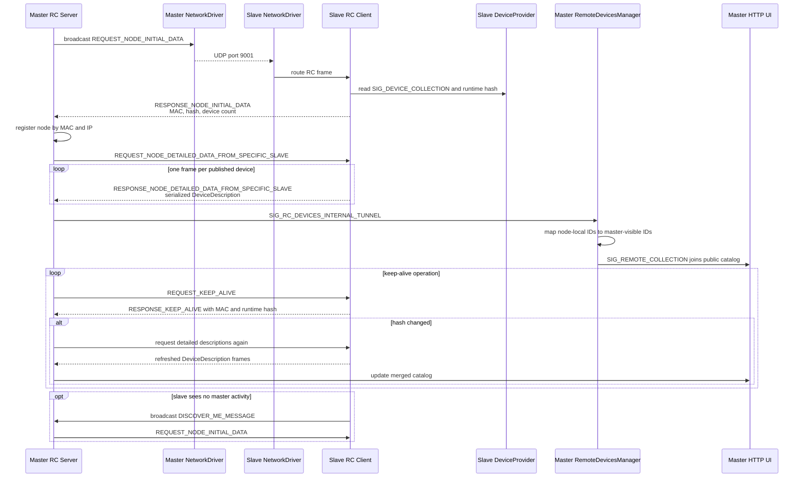
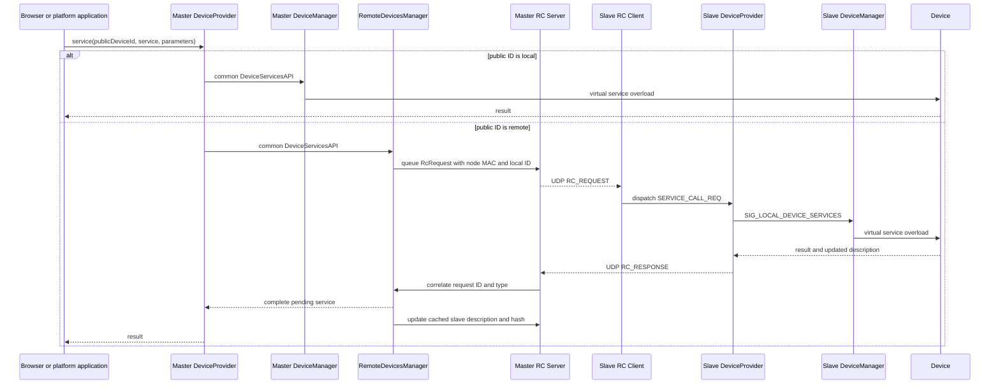
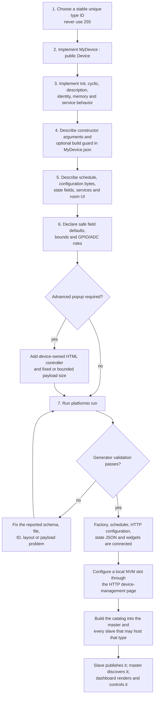

# HomeControlStation architecture

This page is the shortest path from an empty checkout to understanding how the platform, generated integration code, concrete devices, browser UI, and ESP32 UDP network fit together.

## 1. Architecture at a glance



The important boundary is simple:

- **Platform code** knows the `Device` interface, common configuration/state containers, common service payload shapes, and generated registries. It does not construct concrete classes manually.
- **Device code** owns hardware behavior and the meaning of its custom bytes. Its JSON description tells the generators how the platform should construct, schedule, expose, configure, and render it.
- **Generated code** is the compile-time adapter between those two sides. Never edit it manually.

## 2. What happens on every compilation

The scripts are registered as PlatformIO `pre:` scripts in `platformio.ini` and execute before C++ compilation.



When active descriptions exist, all device-dependent outputs are recreated under `include/generated/`. Deleting or renaming a device cannot leave a stale factory case, widget, or serializer in an incremental build. With an empty concrete-device catalog, `include/generated/` remains absent and the platform uses static no-device fallbacks from `include/devices/fallback/`. The firmware still compiles and treats every received or persisted device type as unknown.

### Active catalog versus predefined catalog

Packages under `DevicesPredefined` are always inert. The device set for a firmware image is the concrete package directories currently copied into `include/devices` and `src/device`. Before building a preset, use the catalog helper to overlay both trees of every wanted package. Activation is additive and copies files rather than linking them, so it neither removes other active packages nor propagates later catalog edits automatically. The registry generator scans only active descriptions, while PlatformIO compiles only active sources under `src`.

For example, an OnOff-only preset contains active `include/devices/OnOffDevice` and `src/device/OnOffDevice` trees copied from the matching predefined overlay. LED device packages also require both trees from the `DevicesPredefined/LedStrip` support package. See `DevicesPredefined/README.md` for exact selection and dependency instructions.

### Inputs and generated consumers

| Device description section | Generated result | Runtime consumer |
|---|---|---|
| `deviceType` | Stable `DevType`, names, known-type lookup | NVM validation, HTTP state |
| `implementation` | Guarded include and factory case | `DeviceManager` |
| `lifecycle.update.schedule` | `cycleIntervalMs` registration metadata | `DeviceManager::cyclic()` |
| `configuration.customBytes` | Browser encoder, defaults, value checks and GPIO claims | HTTP configuration page and `DeviceManager` |
| `state.httpFields` | `DeviceDescription::customBytes` serializer | Dashboard JSON |
| `ui.controls` and `ui.readouts` | Per-device room widget JavaScript | Dashboard renderer |
| `ui.advancedControls` | Embedded HTML pattern and payload sizing | Generic advanced-controls loader |

Optional `implementation.buildGuard` values are resolved by the C++ preprocessor using `SystemDefinition.hpp`. JSON remains the catalog source, while build guards decide whether guarded implementation branches enter a particular firmware image.

## 3. Boot and local-device lifecycle



After boot, `OperatingSystem::task10ms()` invokes `DeviceManager::cyclic()` every 10 ms. The manager uses generated scheduling metadata:



The one-second state publication is independent of the device's own acquisition interval. A sensor may acquire once per minute while the dashboard and UDP node hash continue using the latest state.

### Local configuration, persistence, and restart

The `/localDevices` page renders common slot fields plus generated controls for every active type. When a slot changes to another type, controls use schema `default` values rather than unrelated zero-filled bytes. Defaults are presentation values until Save; stored values are preserved when rendering an existing slot of the same type.

Configuration replacement is transactional across all six slots:

```mermaid
sequenceDiagram
    participant Browser
    participant HTTP as HTTP handler
    participant DM as DeviceManager
    participant Registry as Generated validator
    participant OS as OperatingSystem
    participant Config as ConfigProvider
    participant PM as PersistentMemoryAccess

    Browser->>HTTP: submit six slots and 20 custom bytes each
    HTTP->>DM: setLocalSetupViaJson(payload)
    DM->>DM: validate JSON types, IDs, names and exact lengths
    loop every enabled slot
        DM->>Registry: validateConfiguration(slot, claimed GPIO map)
        Registry->>Registry: check known type, bounds/options,<br/>GPIO range, ADC role and conflicts
    end
    alt any slot invalid
        DM-->>HTTP: false; retain current RAM mirror
        Note over DM,OS: no restart is scheduled
    else complete set valid
        DM->>DM: replace configuration RAM mirror
        DM->>OS: schedule reset after response delay
        OS->>DM: deinit()
        DM->>Config: write six device blocks to merged RAM mirror
        OS->>Config: deinit() last
        Config->>PM: save merged image and safe-shutdown flag
        PM->>PM: commit full-width checksum
        OS->>OS: ESP.restart()
    end
```

Generated GPIO ownership is global to all enabled local slots. Required pins must fit the current ESP32-S3 target (`0..48`, excluding `22..32`), optional fields may use `255`, and no two claimed fields may share a GPIO. A common field marked `hardwareRole: "adc"` is restricted to Wi-Fi-safe ADC1 GPIO `1..10`. Device-specific numeric bounds and select options are generated from JSON. More complex relationships and all service payloads remain the responsibility of C++.

The same generated validation runs while restoring NVM, before device construction. A malformed or conflicting persisted slot is skipped, so it cannot initialize GPIO hardware; valid later slots can still load because GPIO claims are transactional per slot. Type IDs and byte layouts are permanent deployed contracts: changing their meaning requires an explicit migration rather than silently reusing existing NVM bytes.

## 4. One public device catalog

`DataContainer` is the in-process message bus. Components publish typed values and callback APIs under shared signal IDs rather than including each other's concrete implementations.



Local device IDs are retained. On a master, `RemoteDevicesManager` maps each remote `{node MAC, node-local device ID}` to a stable public ID range. `DeviceProvider` remembers whether each public ID is local or remote and routes every common service call accordingly.

## 5. ESP32 UDP network flow

Every ESP32 runs the same platform. Node configuration independently selects whether HTTP is enabled and whether the node is the UDP **RC server (master)** or **RC client (slave)**. UDP remote-control frames use port `9001`.

### Discovery, state synchronization, and health monitoring



The master periodically broadcasts discovery even after entering keep-alive mode, so a newly started slave can join an already running network. A changed slave runtime hash triggers detailed-data refresh rather than continuous transmission of every state byte.

### User command to a local or remote device



The service overloads are common transport shapes:

- `serviceCall_NoParams`: command only.
- `serviceCall_1`: small byte parameters.
- `serviceCall_2`: floating-point parameters.
- `serviceCall_3`: opaque variable-size bytes, including generic advanced controls and extended data.

Device-specific byte interpretation stays in the concrete device implementation and, for browser popups, its device-owned HTML controller.

## 6. Adding a new device type

Create matching active include and source directories:

```text
include/devices/MyDevice/
├── MyDevice.hpp
├── MyDevice.json
└── AdvancedControls.html       # optional

src/device/MyDevice/
└── MyDevice.cpp
```

Ready-made packages are not active in a clean checkout. Select only the required entries from `DevicesPredefined` and copy both their `include/` and `src/` overlays before building. When a newly developed package is ready for reuse, store both path trees under `DevicesPredefined/MyDevice`.

Then follow this flow:



### Device implementation responsibilities

The class derives from `Device` and owns:

- GPIO/bus/sensor setup in `init()`.
- Non-blocking periodic work in `cyclic()`; its invocation interval comes from JSON.
- `DeviceDescription`, including common fields and documented custom state bytes.
- Supported `service()` overloads and validation of their payloads.
- Optional extended-memory length and use.
- The binary contract shared with its optional advanced-controls HTML controller.

### JSON responsibilities

Use `include/devices/device.schema.json` and a predefined description such as `DevicesPredefined/OnOffDevice/include/devices/OnOffDevice/OnOffDevice.json` as references. At minimum, verify:

1. `deviceType.enumValue` is stable and unique; `255` is reserved.
2. `implementation.header` and `implementation.source` point to real files.
3. `implementation.factory.arguments` matches an allowed generated runtime argument list.
4. `implementation.manager.registered` is `true` for a constructible device.
5. `lifecycle.update.schedule` is either every manager cycle or a fixed positive interval.
6. Configuration-byte offsets and state-byte offsets match the C++ implementation.
7. HTTP state fields describe how custom state bytes become browser JSON.
8. UI controls reference services actually implemented by the class.
9. Advanced-control fixed or maximum dynamic payload size does not exceed 391 bytes.
10. C++ `static_assert` checks any packed binary layout shared with HTML.
11. Every nonzero-constrained generated control has a safe `default`.
12. GPIO fields declare valid bounds and optionality; ADC common pins use `hardwareRole: "adc"`, and conditional GPIOs use `claimWhen` when needed.

### Network deployment rule

The UDP protocol transports numeric type IDs and `DeviceDescription` bytes, not C++ implementations or JSON metadata. Therefore:

- A slave needs the generated factory and concrete implementation to instantiate the physical device.
- The master needs the same JSON-derived state and widget metadata to understand and render that remote type.
- The safest deployment is to build the same device catalog into all HomeControlStation nodes, then use NVM slot configuration to select which physical devices each node actually instantiates.

## 7. Source map

| Concern | Primary source |
|---|---|
| Build script ordering | `platformio.ini` |
| Device registry generation | `extra/generate_device_registry.py` |
| Configuration widget generation | `extra/generate_device_config_widgets.py` |
| Device metadata schema | `include/devices/device.schema.json` |
| Generic device abstraction and services | `include/devices/device.hpp` |
| Compile-time optional hardware | `include/SystemDefinition.hpp` |
| NVM restoration, factory use and scheduling | `src/os/app/devicemanager.cpp` |
| In-process signals and APIs | `include/os/datacontainer/signals.hpp` |
| Public local/remote device routing | `src/os/app/deviceProvider.cpp` |
| Wi-Fi, UDP dispatch and OTA | `src/os/drivers/networkdriver.cpp` |
| Master discovery and RC transport | `src/os/app/remoteControl/remotecontrolserver.cpp` |
| Slave discovery responses and RC handling | `src/os/app/remoteControl/remoteControlClient.cpp` |
| Master remote ID mapping | `src/os/app/RemoteDevicesManager.cpp` |
| HTTP server and dashboard | `src/os/app/http/` and `include/os/app/http/` |
| Predefined device examples | `DevicesPredefined/` (OnOff, button, DHT, LED, blind, contact, gate, and aquarium packages) |
| Preset selection instructions | `DevicesPredefined/README.md` |

## 8. Timing and limits quick reference

| Item | Current behavior |
|---|---|
| Network driver task | Every 2 ms |
| Device, provider, and RC task | Every 10 ms |
| HTTP server task | Every 100 ms when enabled |
| Local description publication | Every 1 second |
| Browser full device refresh | Every 1 second |
| Master discovery retry during normal operation | Every 30 seconds |
| Master keep-alive scheduling | Requests are considered every 2.3 seconds; each node is rate-limited by its own request timestamp |
| Local NVM device slots | 6 |
| Configuration custom bytes per slot | 20 |
| Required GPIO range | `0..48`, excluding ESP32-S3 `22..32`; claimed assignments must be unique |
| Wi-Fi-safe ADC role | ADC1 GPIO `1..10` |
| Reserved unknown device type | 255 |
| Device description custom bytes | 50 |
| Generic advanced-control payload | Maximum 391 bytes |

---

**Mental model:** JSON describes integration, defaults, and hardware claims; generated code connects and validates it; `DeviceManager` transactionally persists and owns local instances; `DataContainer` distributes state and APIs; `DeviceProvider` hides local-versus-remote routing; and the RC server/client pair carries the same service and description model across UDP.
